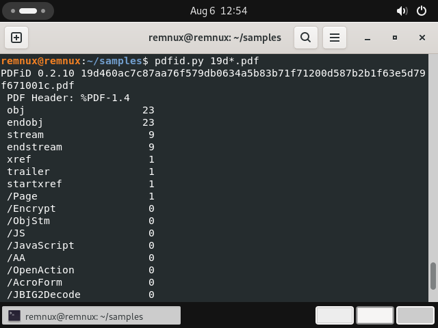
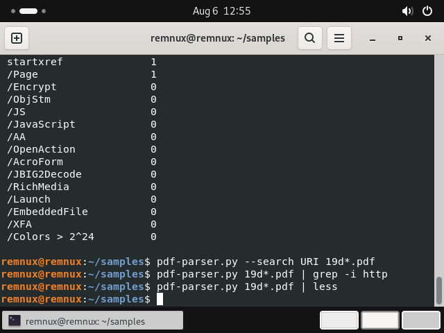
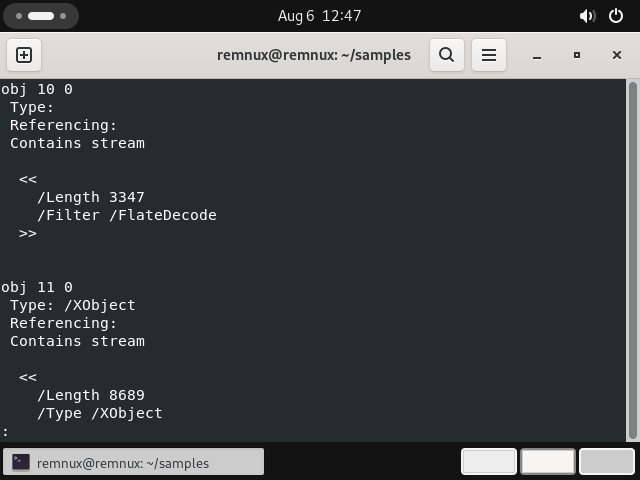
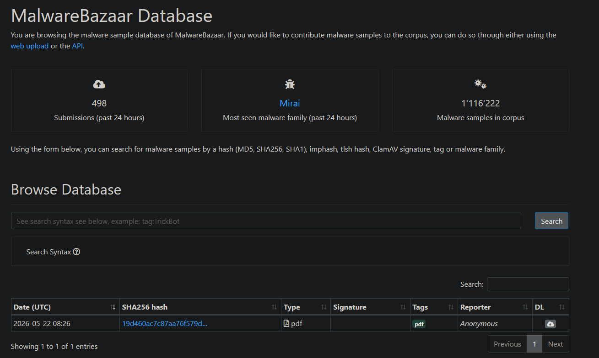

# Case 01 — Benign PDF (Correct Clearance)
 
**Verdict:** Benign — Medium-High confidence
**Sample SHA-256:** `19d460ac7c87aa76f579db0634a5b83b71f71200d587b2b1f63e5d79f671001c`
**File type:** PDF 1.4, 1 page
**Source:** MalwareBazaar
**Analyzed:** Isolated REMnux VM, static analysis only (never executed)
 
---
 
## Summary
 
A PDF submitted to a malware repository that, on full static analysis, contains no
executable content, no automatic actions, and no embedded or text-based links. Assessed
as benign — no malicious capability identified.
 
## Evidence
 
**1. Active-content scan — `pdfid.py`**
 
All dangerous PDF object types returned a count of zero:
 
| Keyword | Count | What a nonzero value would mean |
|---|---|---|
| `/JS`, `/JavaScript` | 0 | Embedded JavaScript |
| `/OpenAction`, `/AA` | 0 | Code running automatically on open |
| `/Launch` | 0 | Launching an external program |
| `/EmbeddedFile` | 0 | A file hidden inside the PDF |
| `/AcroForm`, `/XFA` | 0 | Interactive forms (credential capture) |
| `/JBIG2Decode`, `/RichMedia` | 0 | Known exploit-prone decoders/objects |
| `/Encrypt` | 0 | Encrypted content obscuring analysis |
| `/ObjStm` | 0 | Object streams (which could conceal objects from surface scans) |
 
Structural objects only: 23 `obj`, 9 `stream`, 1 `/Page`.
 

*`pdfid.py` output — every active-content keyword returns zero*

**2. Link analysis — `pdf-parser.py`**
 
- `pdf-parser.py --search URI` → no results (no link objects)
- `pdf-parser.py | grep -i http` → no results (no URLs in page text)
Both empty. This matters because modern malicious PDFs are frequently *link-based lures*
rather than code exploits — a clean `pdfid` alone is not sufficient to clear a PDF, so URL
presence was specifically tested for.
 

*No link objects and no URLs in page text — both searches return nothing*

**3. Content composition**
 
Object dump showed only `/FlateDecode` compressed streams (standard page content) and an
`/XObject` (an embedded image). Normal document structure throughout.
 

*Object dump — only FlateDecode compressed streams and an image XObject*

**4. Threat intelligence context**
 
MalwareBazaar carries this sample with the generic tag `pdf` only — **no malware family, no
signature**, reporter listed as *Anonymous*.
 

*MalwareBazaar: generic `pdf` tag only, no malware family, reporter Anonymous*

## Impact
 
None identified. The file carries no executable code, no auto-execution triggers, no
embedded payload, and no phishing links.
 
## IOCs
 
| Type | Value |
|---|---|
| SHA-256 | `19d460ac7c87aa76f579db0634a5b83b71f71200d587b2b1f63e5d79f671001c` |
 
No network indicators — the file contains no URLs or domains.
 
## Actions
 
- **No blocking action required** for this file on its own merits.
- Retain the hash for reference only.
- If encountered in a real queue: close as benign with the evidence chain above; no
  escalation warranted.
## Analyst note
 
Not every file in a malware corpus is malicious. This sample was tested for both attack
models, embedded code *and* link-based lures, and cleared on both. Correctly clearing a
file is as important as catching one: over-flagging erodes trust and wastes
response capacity. The evidence supports a benign verdict, and the verdict is stated with
appropriate (not absolute) confidence, since static analysis cannot rule out context not
visible in the file.
 
## Screenshots
 
| File | Shows |
|---|---|
| `19d-pdfid-results.png` | pdfid keyword counts |
| `suspicious-19d.png` | Object dump — FlateDecode streams + image XObject |
| `19d-no-urls-results.png` | Empty URI / http searches |
| `19d-bazaar-results.png` | MalwareBazaar entry: `pdf` tag only, no family, Anonymous |
 

